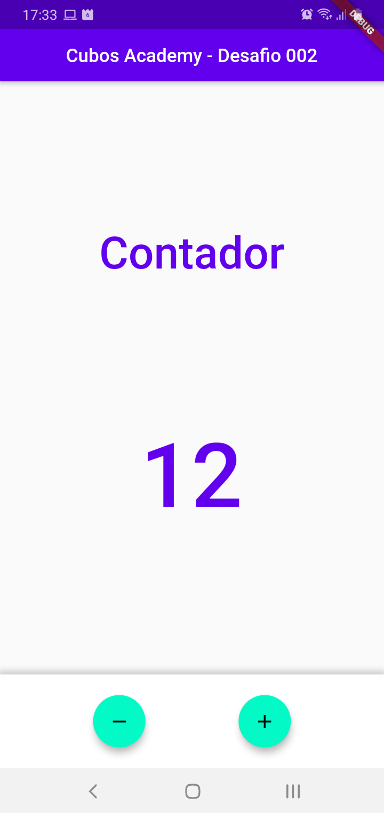

<h1 align="center">
    Cubos Academy  
</h1>

 Reconstruir App Demo 
  

[//]: # (Adicione seus gifs / imagens aqui:)

 
   

## **Informações:**
[//]: # (Descreva seu objetivo e o que foi usado no projeto:)

* <i><strong>`Desafio`</strong></i> - `Reconstruir App Demo.`

* `Scaffold()`
* `Column()`
* `Text()`
* `Row()`
* `FloatActionButtons()`
* `setState()`

* [x] Adicionar as mudanças aos commits (git add . para adicionar todos os arquivos ou git add nome_do_arquivo para adicionar um arquivo específico)

* [x] Commitar a cada mudança significativa ou na finalização do exercício (git commit -m "Mensagem do commit")

* [x] Pushar os commits na sua branch na origem (git push origin nome-da-branch)
  

## **Linguagens e Ferramentas:**
[//]: # (Adicione os recursos do seu projeto aqui:)

- <code></code> **Flutter**
- <code></code> **Dart**